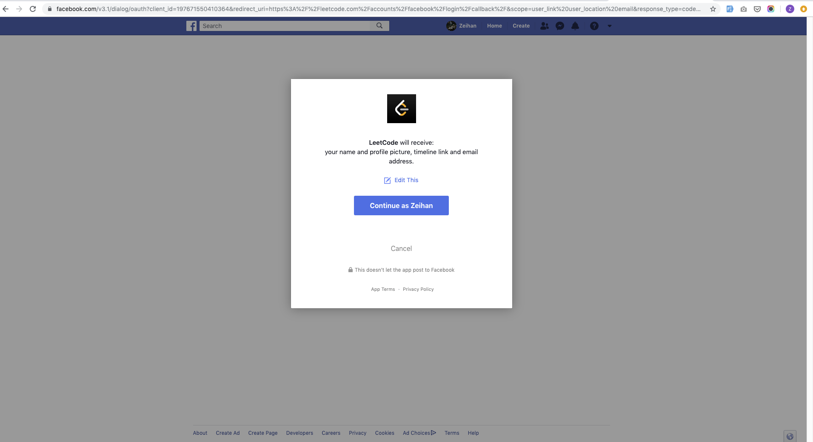

# Bagaimana cara oauth bekerja

OAuth adalah sekuriti protokol yang kompleks karena ada beberapa komponen yang berkaitan. Komponen yang ada pada Oauth yaitu.

- The resource owner
- The protected resource
- The client
- The authorization server

Tapi secara garis besar sebenarnya Oauth hanya sekedar menerbitkan token dan menggunakan token. Token dapat digunakan oleh client untuk mengakses api yang dijaga. Alih alih menggunakan credensial yang sebenarnya, authorization server akan memberikan token delegasi agar client bisa mengakses protected resource. Kalau dinarasikan seperti ini ceritanya.

- The Resource Owner (TRO) mengakses aplikasi The Client (TC) menggunakan gmail. (Silahkan ambil data profile saya di gmail)
- The Client (TC): akan meminta otorisasi dari resource owner ke server authorisasi gmail.
- TRO: memberikan otorisasi kepada client
- TC: menerima token dari authorization server.
- TC: mengakses api dari resource yang diprotect dengan token itu.

## OAuth 2.0 Grant Types

Ada beberapa jenis Grant Types bisa dilihat langsung di website resmi dari OAuth [https://oauth.net/2/grant-types/](https://oauth.net/2/grant-types/). 

- Authorization Code
- Implicit
- Password
- Client Credentials
- Device Code
- Refresh Token

### Code Grant Type

Code Grant Type adalah bentuk delegasi yang interaktif dimana ada form yang memberikan kesempatan untuk resource owner (customer atau user yang mengakses situs) memperbolehkan atau menolak dan jika disetujui maka client mengirimkan resource owner ke endpoint authorization server. Lalu authorization server akan mengirimkan authorization code ke client lewat `redirect_uri`.

Contoh nyatanya seperti gambar ini:

